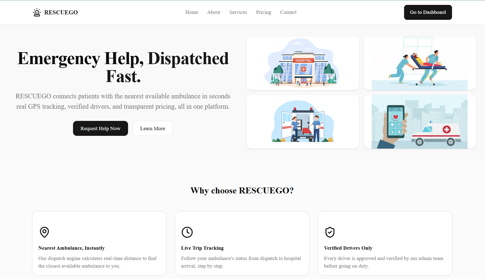

# RESCUEGO Frontend - Ambulance Dispatch & Emergency Management

The Next.js frontend for **RESCUEGO**, a real-time ambulance dispatch platform. Patients request an ambulance with their live GPS location, admins dispatch the nearest available driver, drivers run the trip through a step-by-step status flow, and payment is settled through Stripe.

Built for the SAVE LIFE.

---
## Demo Images



## Links

| | |
|---|---|
| **Live Frontend**|https://rescuego-frontend.vercel.app |
| **Live Backend** | https://rescuego-backend.vercel.app |
| **Backend Repo** | https://github.com/Arnob-Mutsuddy/rescuego-backend |
| **API Docs (Postman)** | https://documenter.getpostman.com/view/54724313/2sBYB2r7H2 |


---

## Demo Credentials

The login page has **one-click Demo Login** buttons for all three roles. Manual credentials:

| Role | Email | Password |
|---|---|---|
| Admin | `admin@gmail.com` | `Password123` |
| Patient | `aronno@gmail.com` | `Password123` |
| Driver | `driver@gmail.com` | `Password123` |

> Stripe test card: `4242 4242 4242 4242` · any future expiry · any CVC.

---

## Features

### Patient
- Request an ambulance with live GPS (`navigator.geolocation`), emergency type and severity
- Track request status; cancel pending or assigned requests
- Filter and paginate request history (state kept in the URL)
- Pay for completed trips through Stripe Checkout; a "Paid" badge replaces the Pay Now button
- Rate and review the driver after a trip
- Manage profile and medical info

### Driver
- Start/stop duty, which captures GPS
- Background location pinger sends GPS every 30 seconds while on duty
- Receive assigned emergencies (auto-refetch every 15 seconds); accept or reject
- Trip status stepper: En Route -> Arrived -> Picked Up -> At Hospital -> Completed
- Register ambulances; view earnings, statistics and trip history

### Admin
- Analytics dashboard with Recharts (bar and pie charts)
- **Dispatch workflow**: finds the nearest ambulances (Haversine distance), assigns a driver and destination hospital
- Approve or reject drivers; activate or deactivate users (search, role filter, pagination)
- Full hospital CRUD (soft delete with confirmation dialog)
- Reports: all emergency requests and audit logs

### Public
- Home with live platform stats, partner hospital list and a searchable map (defaults to all of Bangladesh)
- About, Services, Pricing/FAQ, Contact

---

## Tech Stack

| Category | Technology |
|---|---|
| Framework | Next.js (App Router), React, TypeScript |
| Styling / UI | Tailwind CSS, shadcn/ui (Radix UI), Lucide icons |
| Server state | TanStack Query |
| Client state | Zustand (with `persist`) |
| Forms | React Hook Form + Zod |
| HTTP | Axios (token interceptor, 401 handling) |
| Charts | Recharts |
| Notifications | Sonner |
| Payments | Stripe Checkout (test mode) |
| Deployment | Vercel |

---

## Architecture Highlights

- **Server vs Client Components:** pages with static content (About, Services, Pricing) are Server Components with exported `metadata`. `"use client"` is used only where interactivity is needed (forms, dialogs, query hooks, sidebars).
- **Route groups:** `(public)` and `(auth)` organise layouts without changing URLs.
- **Route protection:** middleware reads the auth cookie and role cookie. Unauthenticated users are redirected to `/login`; a user who opens another role's area is redirected to their own dashboard. The sidebar and UI are also role-aware.
- **Loading and errors:** every data route has a `loading.tsx` skeleton, plus root `error.tsx` and a custom `not-found.tsx`. API failures show toast notifications.
- **URL state sync:** filters, search and pagination live in the URL via a reusable `useUrlState` hook (`useSearchParams`), so views are shareable and bookmarkable. Components using it are wrapped in `<Suspense>`.
- **Type safety:** domain models are defined in `types/index.ts`, API calls are typed end to end, and errors go through a `getErrorMessage` helper. The codebase has no `any` types.
- **Reusable pieces:** `StatCard`, `StatusBadge`, `EmptyState`, and hooks such as `useDebouncedValue`, `useGeolocation`, `useUrlState`.

### Folder Structure

```
rescuego-frontend/
├── app/
│   ├── (public)/            # Home, About, Services, Pricing, Contact
│   ├── (auth)/              # Login (demo login), Register
│   ├── dashboard/           # Patient: activity, profile, payments
│   ├── provider/            # Driver: tasks, earnings, profile
│   ├── admin/               # Admin: overview, manage, reports
│   ├── payment/             # success, cancel
│   ├── error.tsx  loading.tsx  not-found.tsx
│   └── layout.tsx
├── components/
│   ├── ui/                  # shadcn components
│   ├── layout/              # navbars, sidebars
│   ├── shared/              # StatCard, StatusBadge, EmptyState
│   ├── patient/  driver/  admin/  public/  forms/  providers/
├── lib/
│   ├── api/                 # axios instance + typed API modules
│   ├── hooks/               # TanStack Query hooks, custom hooks
│   ├── validations/         # Zod schemas
│   └── error.ts  nav-config.ts  demo-accounts.ts
├── store/                   # Zustand stores (auth, ui)
├── types/                   # TypeScript domain types
└── middleware.ts            # role-based route protection
```

---

## Getting Started

### Prerequisites
- Node.js 20+
- npm
- The RESCUEGO backend (deployed, or running locally)

### Installation

```bash
git clone https://github.com/Arnob-Mutsuddy/rescuego-frontend.git
cd rescuego-frontend
npm install
```

### Environment Variables

Create `.env.local`:

```env
NEXT_PUBLIC_API_URL=https://rescuego-backend.vercel.app/api/v1
NEXT_PUBLIC_APP_URL=http://localhost:3000
NEXT_PUBLIC_STRIPE_PUBLISHABLE_KEY=pk_test_xxx
```

To use a local backend instead, set `NEXT_PUBLIC_API_URL=http://localhost:5000/api/v1`.

### Run

```bash
npm run dev       # development
npm run build     # production build
npm run start     # run production build
npm run lint      # lint
```

---

## Payment Flow

1. Driver completes a trip → request status becomes `COMPLETED`
2. Patient clicks **Pay Now** → frontend calls `POST /payments/checkout` → redirects to Stripe Checkout
3. After payment, Stripe redirects to `/payment/success` (or `/payment/cancel`)
4. The backend webhook marks the payment `SUCCESS`; the dashboard then shows a **Paid** badge

> The backend must have `FRONTEND_URL` set to this app's URL so Stripe redirects correctly.

---

## Testing the Full Workflow

1. **Driver:** log in, make sure the account is approved and has an ambulance, then **Start Duty**
2. **Patient:** log in and **Request Ambulance**
3. **Admin:** Reports → Emergency Requests → **Dispatch** → choose driver and hospital → **Assign**
4. **Driver:** accept the request and step through the trip status until **Completed**
5. **Patient:** **Pay Now** → pay with the Stripe test card → leave a review

---

## Pages (18+)

**Public:** Home · About · Services · Pricing · Contact  
**Auth:** Login · Register  
**Patient:** Dashboard · Profile · Payments  
**Driver:** Tasks · Earnings · Profile  
**Admin:** Overview · Manage · Reports  
**Utility:** Payment Success · Payment Cancel · 404 · Error boundary

---

